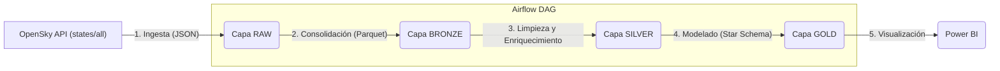

# PROYECTO FINAL

Imprementación de la arquitectura Medallón y modelo estrella con Databricks y Power BI

### 🏠 PIPELINE DE TRANSACCIONES INMOBILIARIAS EN COLOMBIA (IGAC)

Este proyecto implementa un pipeline de datos bajo el enfoque ELT (Extract, Load, Transform) para la ingesta de información de transacciones inmobiliarias del IGAC. Se adopta la arquitectura Medallon para el procesamiento de los datos y su posterior modelado en un esquema en estrella, con el objetivo de facilitar su consumo en un dashboard desarrollado en Power BI. Los datos fueron obtenidos a través de la API de Datos Abiertos de Colombia.

###🎯 OBJETIVO

Analizar el comportamiento del mercado inmobiliario en Colombia entre 2015 y 2023, identificando tendencias en el valor de las transacciones, variaciones regionales, dinámicas por tipo de inmueble y evolución temporal del precio promedio, con el fin de generar información estratégica para la toma de decisiones basada en datos.

###🪢 ARQUITECTURA

Aquí tienes una versión ajustada:

> Los datos se gestionan bajo la arquitectura Medallion, lo que permite garantizar su control, calidad e integridad a lo largo de las diferentes capas del pipeline.
 

### Stack Tecnológico y Herramientas

Este proyecto utiliza un conjunto de herramientas modernas de ingeniería de datos para construir el pipeline de principio a fin:

#### **Orquestación y Entorno**
* **Azure Databricks:** Plataforma unificada de análisis para la ejecución de procesos de cómputo distribuido.
* **Databricks Workflows:** Orquestador nativo para la programación de tareas, gestión de dependencias y monitoreo del flujo de datos de principio a fin.

#### **Fuente de Datos**
* **Registro Predial (JSON):** Ingesta de archivos semiestructurados con información técnica de predios, matrículas, folios y planes de gobierno.

#### **Procesamiento y Transformación (ELT)**
* **Arquitectura Medallón:** Implementación de capas **Bronze** (Raw), **Silver** (Cleansed) y **Gold** (Curated).
* **PySpark (Apache Spark):** Motor principal para la ingesta masiva y transformaciones distribuidas de grandes volúmenes de datos.
* **Pandas:** Utilizado para la normalización técnica de esquemas mediante `reindex`, manejo de tipos de datos `Int64` y limpieza profunda de series temporales.
* **Spark SQL:** Definición estricta de esquemas (DDL) y creación de tablas delta con tipado fuerte.

#### **Almacenamiento (Data Lakehouse)**
* **Delta Lake:** Formato de almacenamiento abierto que proporciona:
    * **Transacciones ACID:** Garantiza la integridad en escrituras concurrentes.
    * **Schema Enforcement:** Evita la degradación de la calidad de los datos.
    * **Time Travel:** Control de versiones y auditoría de cambios en los datos.
* **Azure Data Lake Storage (ADLS) Gen2:** Repositorio principal de almacenamiento en la nube.

#### **Visualización y Business Intelligence**
* **Microsoft Power BI:** Herramienta de BI conectada a la **Capa Gold** para la visualización de KPIs, análisis de ruralidad y dinámicas prediales interactivas.

