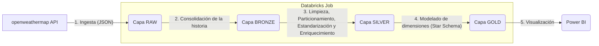

# DSRP- Python Para Ingenieria de datos
Implementación de un proceso ELT para el curso Python Para Ingenieria de datos de la especialización de Data Engineering del Instituto Data Science Research Peru

# Pipeline de Análisis de calidad de aire (openweathermap) con Databricks y Arquitectura Medallón

Este proyecto implementa un pipeline de datos ELT (Extract, Load, Transform) de extremo a extremo que ingesta datos de Calidad de aire diariamente desde la API de **openweathermap**, los procesa siguiendo la **Arquitectura Medallón** (Bronce, Silver, Gold) y los modela para ser consumidos por un dashboard en **Power BI**.

El pipeline está completamente orquestado con **Databricks**, utilizando el apartado de Jobs y Pipelines.

##  Objetivo

El objetivo es capturar información de la calidad de aire en el departamento de Lima por cada distrito y día para construir un modelo de datos que permita analizar la información en un dashboard interactivo.

##  Arquitectura

El flujo de datos sigue la Arquitectura Medallón, asegurando la trazabilidad, calidad y reprocesabilidad de los datos.

##  Stack Tecnológico y Herramientas

Este proyecto utiliza Databricks para construir el pipeline de principio a fin:

* **Desarrollo y Orquestación:**
    * **Databricks Notebooks** Utilizado para el desarollo de la lógica de carga y actualización de las tablas.
    * **Databricks Jobs Y Pipelines** Utilizado para la orquestación, programación y monitoreo de todo el pipeline. Se declaran parametros y valores automáticos para los notebooks dentro 

* **Fuente de Datos:**
    * **openweathermap API**: Es la fuente de datos (endpoint `http://api.openweathermap.org/data/2.5/air_pollution/history?lat={lat}&lon={lon}&start={start_ts}&end={end_ts}&appid={api_key}`) que provee la información diaria de la calidad de aire.

* **Procesamiento y Transformación (ELT):**
    * **Python:** Lenguaje principal utilizado para toda la lógica de ingesta y transformación.
    * **Pandas:** Biblioteca clave para la manipulación, limpieza, enriquecimiento y estructuración de los datos en las capas Bronze y Silver.
    * **PySpark:** Biblioteca esencial para el procesamiento distribuido y escalable de grandes volúmenes de datos, clave en la construcción de las capas Bronze, Silver y Gold. Permite ingestar, transformar y enriquecer datasets con eficiencia, soportando particionado, incremental loads y escritura en formato Delta para asegurar calidad y rendimiento en los pipelines ELT.

* **Almacenamiento (Data Lake):**
    * **JSON:** Formato elegido para la capa Raw.
    * **Apache Parquet:** Formato de almacenamiento columnar elegido para las capas Bronze, Silver y Gold. Es altamente eficiente para consultas analíticas y ofrece alta compresión.

* **Visualización (Business Intelligence):**
    * **Microsoft Power BI:** Herramienta final para conectarse a la Capa Gold (el Esquema Estrella) y construir el dashboard interactivo que visualiza los KPIs y la información histórica.
